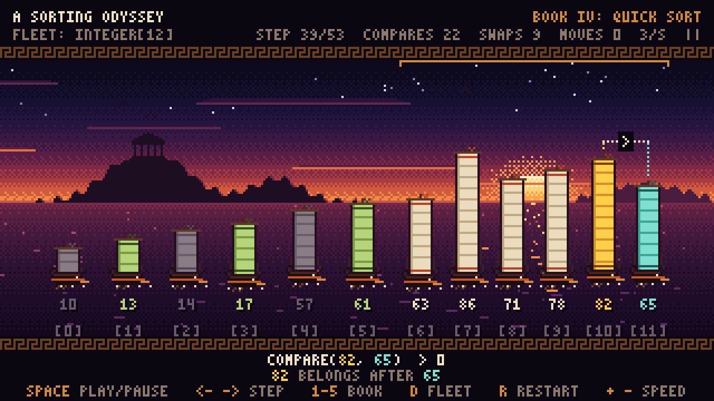

# Sắp xếp (Sorting)

| Package | Class | Syllabus | Giáo trình |
|---|---|---|---|
| `sort` | `Sorter` | 6.8 Comparing Sorting Algorithms | 12.4 |
| `sort` | `SelectionSort` | 6.1 Selection-Sort | 9.4.1 |
| `sort` | `InsertionSort` | 6.2 Insertion-Sort | 3.1.2, 9.4.1 |
| `sort` | `BubbleSort` | 6.3 Bubble-sort | |
| `sort` | `QuickSort` | 6.4 Quick-Sort | 12.2 |
| `sort` | `MergeSort` | 6.5 Merge-Sort | 12.1 |
| `sort` | `SortingVisualizer` | phát lại từng bước của thuật toán | |
| `sort.sample` | `Student`, `Book` và các class `*Demo` | chạy thử | |

## Cây kế thừa

```
Sorter<T>                    compare, swap, set, copy: làm việc thật, đếm, báo cho Observer
│                            split, focus, pivot: chỉ báo thuật toán đang xét đoạn nào
├── BubbleSort<T>
├── SelectionSort<T>
├── InsertionSort<T>
├── QuickSort<T>             phân hoạch Lomuto, pivot là phần tử cuối
└── MergeSort<T>             chia đôi từ trên xuống, dùng mảng phụ aux
```

## Lõi trong Sorter

Các lớp con chỉ đụng tới dữ liệu qua bốn method `protected` của `Sorter`:

| Method | Việc làm | Bộ đếm |
|---|---|---|
| `compare(a, b)` | trả về `a.compareTo(b)` | `getCompareCount()` |
| `swap(arr, i, j)` | đổi chỗ `arr[i]` và `arr[j]`; khi `i == j` thì bỏ qua, không đếm | `getSwapCount()` |
| `set(arr, i, v)` | gán `arr[i] = v`: insertion sort dịch phần tử, merge sort ghi lại từ `aux` | `getMoveCount()` |
| `copy(from, to, lo, hi)` | chép `from[lo..hi]` sang `to[lo..hi]` | `getMoveCount()`, mỗi phần tử một lần |

Mỗi đối tượng sorter giữ bộ đếm riêng, nên hai sorter chạy trên hai mảng cho ra hai con số độc
lập.

Ba method `split(lo, mid, hi)`, `focus(lo, hi)` và `pivot(p)` không đụng vào mảng. Merge sort gọi
`split` ở mỗi lần chia đôi, quick sort gọi `focus` và `pivot` khi bắt đầu phân hoạch một đoạn.

Mọi method kể trên đều báo cho `Sorter.Observer` gắn qua `setObserver`. Observer mặc định không
làm gì. `SortingVisualizer` là một observer, nên thuật toán viết trên lõi này được vẽ ra mà không
cần thêm code.

## SortingVisualizer



```java
SortingVisualizer visualizer = new SortingVisualizer();
visualizer.addAlgorithm(QuickSort::new, "Pick a pivot; smaller left, larger right; repeat each side");
visualizer.addArray("by name, then age", students, Student::getName, s -> String.valueOf(s.getAge()));
visualizer.addRandomIntegers(12);
visualizer.open();
```

`addAlgorithm` nhận constructor của một lớp con của `Sorter` và câu tóm tắt in trên thẻ chương.
`addArray` nhận mảng chưa sắp xếp, cách `compareTo` của mảng đó sắp thứ tự, và hai hàm sinh hai
dòng nhãn dưới mỗi con tàu. Khi không có màn hình, như trên GitHub Actions, `open()` chỉ in một
dòng thông báo.

Mỗi phần tử là một chiến thuyền, chiều cao cánh buồm là thứ hạng của phần tử sau khi sắp xếp. Mỗi
lần thuật toán gọi một method của lõi, cửa sổ thêm một bước:

| Method | Trên màn hình |
|---|---|
| `compare` | buồm vàng là `a`, buồm xanh ngọc là `b`, giữa hai cột buồm có dấu `<`, `>` hoặc `=` |
| `swap` | hai buồm màu cam, hai tàu đi vòng qua nhau |
| `set` | tàu vàng tới ô mới, ô cũ giữ bản sao mờ tới khi bị ghi đè; key của insertion sort đứng trên cột nước, ngay trên chỗ trống |
| `copy` | các tàu bay lên dòng sông trên trời (mảng `aux`), nhỏ lại còn 40%, hai nửa của lần trộn đứng tách nhau |
| `split` | đoàn tàu tách ra sau `mid`, ngoặc đồng phía trên đánh dấu đoạn đang xét |
| `focus` | tàu ngoài đoạn đang xét chuyển sang màu xám |
| `pivot` | buồm tím; khi pivot về đúng chỗ thì buồm chuyển xanh ô liu và tàu tách khỏi hai bên |

Phím: `Space` chạy hoặc dừng, `<-` và `->` lùi hoặc tiến một bước, `1` tới `9` chọn thuật toán theo
thứ tự gọi `addAlgorithm`, `D` đổi mảng, `R` chạy lại với mảng số nguyên ngẫu nhiên mới, `+` và `-`
đổi tốc độ.

Thuật toán phải đi qua lõi thì hình mới đúng. Gán thẳng `arr[i] = x` làm cửa sổ vẽ tàu sai chỗ. Gọi
thẳng `compareTo` thì cảnh cuối báo bằng chữ đỏ số lần gọi đã đi vòng qua `compare()`.

## Chạy

Với JDK 22 trở lên, đứng ở thư mục gốc của repo:

```bash
java sort/sample/SortingVisualizerDemo.java
```

Với JDK 8 đến 21:

```bash
mkdir -p out
javac -d out $(find sort -name "*.java")
java -cp out sort.sample.SortingVisualizerDemo
```

`SortingDemo` in mảng đã sắp xếp và ba bộ đếm ra console, không mở cửa sổ.
